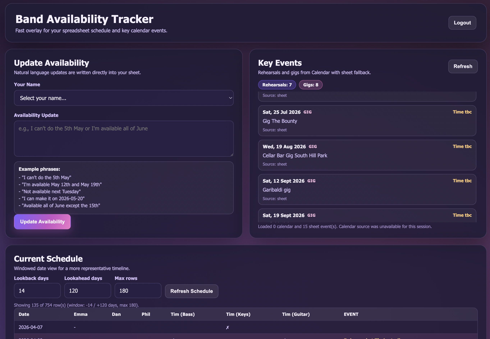

# Band Availability App

Band Availability App is a lightweight web overlay for a Google Sheets-based band availability planner.

It gives band members a fast way to:
- submit availability updates in natural language,
- view a clear, date-windowed schedule,
- and see key events (rehearsals and gigs) in one place.

The spreadsheet remains the source of truth. This app is designed to make that workflow faster and easier to use day-to-day.

## Purpose

This application exists to simplify band scheduling coordination without replacing the existing spreadsheet process.

Instead of manually editing cells every time, users can:
- choose their name,
- enter a plain-English availability update (for example, "I can't do next Tuesday"),
- and let the app parse and write updates into the correct sheet cells.

## What the application does

- **Google OAuth authentication** for secure access to Sheets (and optional Calendar read access).
- **Member-aware availability updates** written directly to Google Sheets.
- **Schedule view** with a representative date window and visual emphasis for:
  - today's row,
  - rows with events,
  - weekend rows.
- **Key Events panel** summarizing rehearsals and gigs from Calendar with sheet fallback.
- **Responsive UI overlay** optimized for quick coordination and at-a-glance decisions.

## Screenshot

Place your screenshot at:

`docs/images/BandAvailabilityApp.png`

It will render below automatically.



## Deployment

The app is currently deployed on **Render** and can continue to run there.

Typical start command:

```bash
gunicorn --config gunicorn.conf.py app:app
```

## Tech stack

- Python / Flask
- Google Sheets API
- Google Calendar API (read-only, optional)
- OpenAI API (for availability text parsing)
- HTML/CSS/JavaScript frontend
